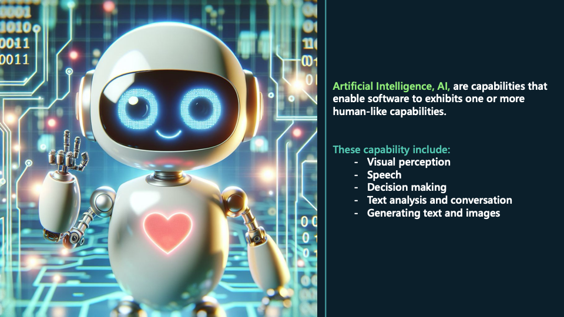
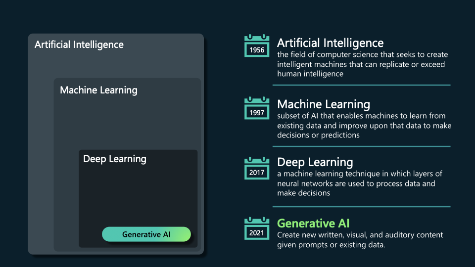

# AI Product Manager

As a product manager, staying ahead of the curve with AI expertise is crucial in today's competitive landscape. This repo will equip you with the skills to identify AI opportunities and deliver significant value.

## Leveraging Data and AI 

This repo is for product managers who want to build AI products. It does not require any prior familiarity with AI. You'll start by learning how AI can be applied, the different types of AI, data needs for AI, and the AI product lifecycle. Then, you'll dive deeper into two types of AI that can leverage existing datasets: personalization and forecasting. You'll learn some technical details about how these models work and how to evaluate them. Finally, you'll pull this all together into a project where you'll develop a PRD for an AI-enabled gift recommendation system in an e-commerce setting.

### Using AI and Machine Learning in Business
- **`Introduction to AI and Machine Learning:`** Understand the essential concepts of AI and machine learning.
- **`Industry Applications:`** Explore examples of traditional and generative AI across various industries.
- **`Make a Business Case for AI:`** Learn how to identify potential AI applications within your organization and create compelling AI solution proposals.
- **`Measure Success for AI Solutions:`** Master the importance of outcome metrics to ensure your AI projects deliver tangible benefits.

#### Inroduction to AI & ML

#### What AI Can Do

Below is a list of some of the things AI can do:

**`Personalization:`** Using AI to analyse user data and tailor products, services, or content to individual preferences and behaviours
- Recommendation systems
- Personalized advertisements

**`Anomaly Detection:`** Identifying patterns in data that deviate significantly from the norm detecting fraud or system failures.
- Fraud alerts
- Quality control

**`Forecasting:`** Predicting future trends and values based on historical data, commonly applied in finance, weather, and sales predictions.
- Financial market predictions
- Demand forecasting
- Predictive maintenance

**`Computer Vision:`** Enabling machines to interpret and understand visual information from the world, such as images and videos.
- Text recognition
- Face and emotion recognition
- Autonomous vehicles

**`Natural Language Processing (NLP):`** Allowing computers to understand, interpret, and generate human language, enabling interactions through text and speech.
- Sentiment analysis
- Voice assistants
- Speech recognition
- Natural language understanding
- Translation

**`Generative AI:`** AI models that create new and realistic content, such as text, images, or music, by mimicking existing data
- Text generation
- Audio generation
- Code generation
- Image generation
